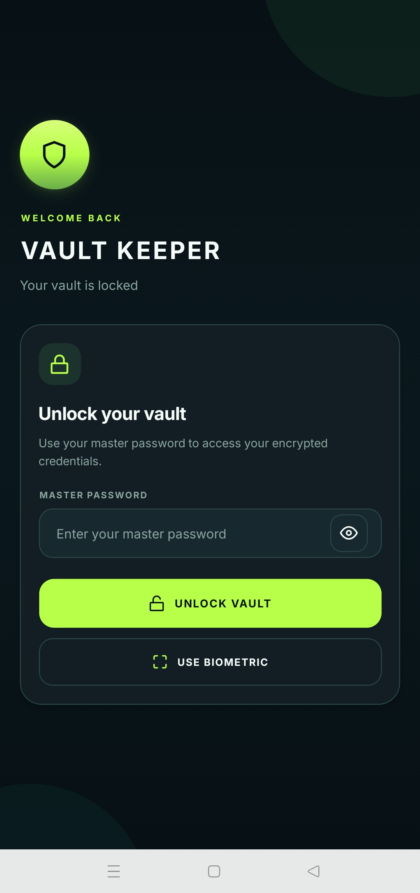
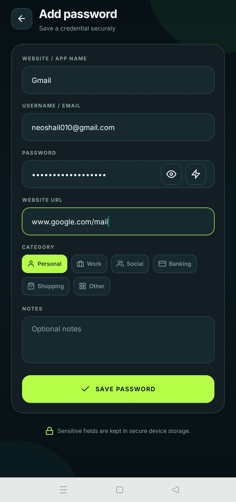
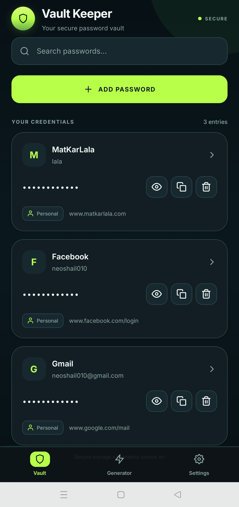
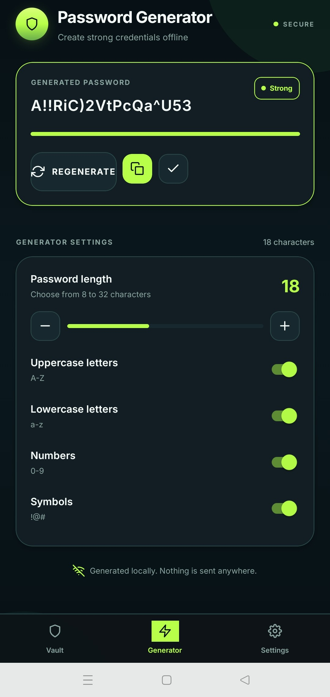
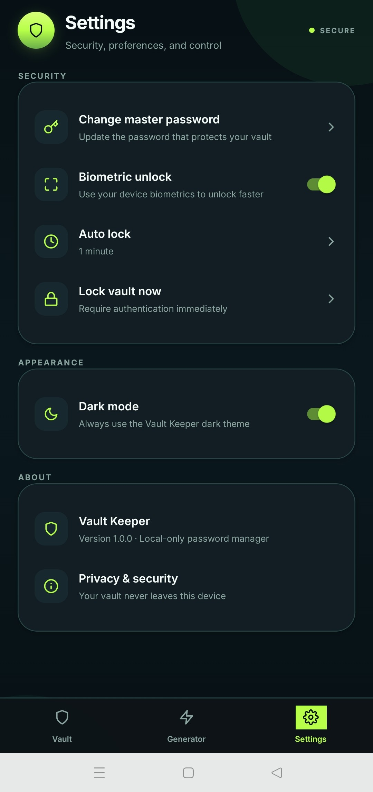
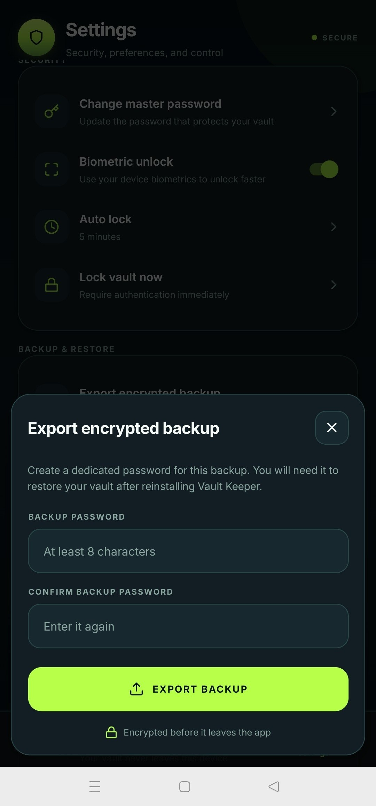

# 🔐 Vault Keeper

**A privacy-focused, local-first password manager for Android.**
> This app helps to keep your passwords secure from google password manager as i don't trust Gooooogle.

Vault Keeper is a modern password vault built with **React Native and Expo** via Replit, designed to store credentials securely on the user's device without relying on a cloud backend.

> **Private by design. Secure by default. Simple to use.**

---
<table>
  <tr>
    <td align="center">
      
      <br>
      <b>1. Vault Keeper Home Screen</b>
    </td>
    <td align="center">
      
      <br>
      <b>2. Add Password Screen</b>
    </td>
    <td align="center">
      
      <br>
      <b>3. Saved Password List</b>
    </td>
    <td align="center">
      
      <br>
      <b>4. Password Generator</b>
    </td>
    <td align="center">
      
      <br>
      <b>5. Settings</b>
    </td>
    <td align="center">
      
      <br>
      <b>6. Backup & Restore (v2 only)</b>
    </td>
  </tr>
</table>


## ✨ Features

### 🔐 Secure Vault

- Master password protected vault
- Secure local credential storage
- Passwords hidden by default
- Add, edit, search, and delete credentials
- Website/app name, username, password, URL, notes, and categories

### 🛡️ Authentication

- Master password authentication
- Optional biometric unlock
- Fingerprint / Face ID support through the device's native biometric system
- Configurable automatic vault locking
- Manual **Lock Vault** option

### ⚡ Password Generator

- Cryptographically secure random password generation
- Customizable password length
- Uppercase letters
- Lowercase letters
- Numbers
- Symbols
- Password strength indicator

### ⚙️ Backup and Restore

- Take backup of saved passwords as .vault file extention
- Restore backup using .vault file.

### 📋 Clipboard Protection

- One-tap password copying
- Temporary clipboard storage
- Automatic clipboard clearing after a short period

### 🎨 Modern UI

- Dark Neon Glassmorphism design
- Dark navy/black background
- Frosted glass cards
- Neon green accents
- Soft ambient glow
- Rounded components
- Light and dark appearance support
- Mobile-first responsive interface

---

## 🏗️ Tech Stack

| Technology | Purpose |
|---|---|
| React Native | Mobile application |
| Expo | Android development/build system |
| Expo Router | Application navigation |
| TypeScript | Type-safe development |
| Expo Secure Store | Secure local storage |
| Expo Local Authentication | Biometric authentication |
| Expo Clipboard | Clipboard functionality |
| Expo Crypto | Cryptographic utilities |
| Expo Blur | Glassmorphism effects |
| Expo Linear Gradient | UI gradients |

---

## 🔒 Privacy & Security

Vault Keeper is designed as a **local-first application**.

The application does not require:

- ❌ Cloud synchronization
- ❌ User accounts
- ❌ Remote password storage
- ❌ Advertising
- ❌ Analytics
- ❌ Tracking
- ❌ Password uploads
- ❌ External password-checking services

Sensitive credentials are intended to remain on the user's device.

The project uses Android/Expo secure-storage and authentication capabilities rather than relying on plaintext local storage.

### Important

Vault Keeper is an educational/personal project and **has not undergone an independent security audit**.

Do not treat this project as a replacement for professionally audited password managers for high-value credentials.

---

## 📱 Project Structure

```text
artifacts/
└── vault-keeper/
    ├── app/
    ├── components/
    ├── ...
    ├── app.json
    ├── eas.json
    ├── package.json
    └── tsconfig.json
